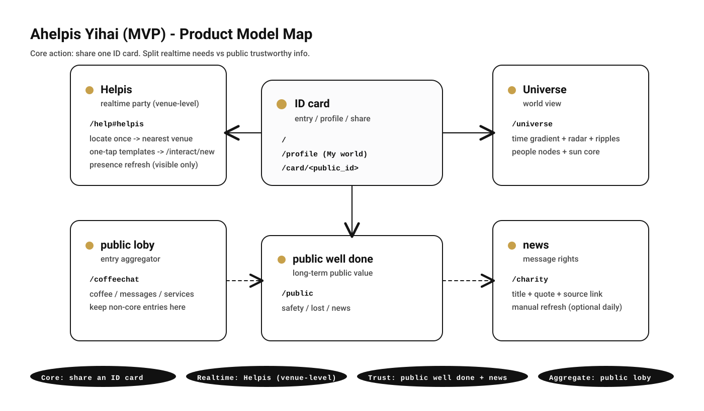
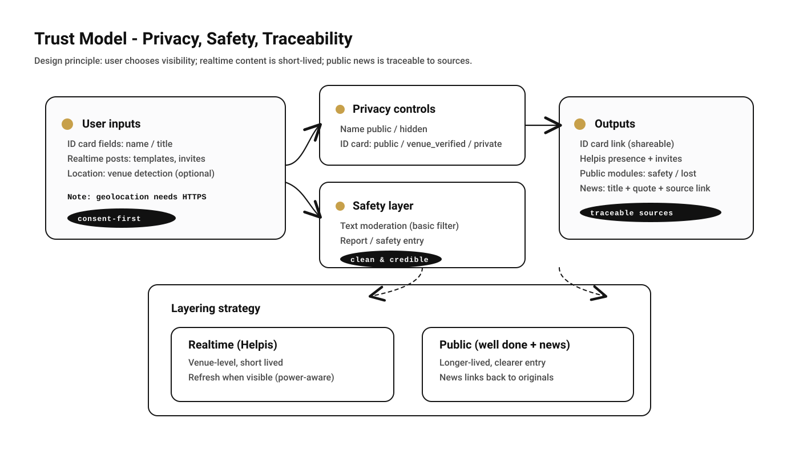

# 一海 Ahelpis（MVP）投资人版 Brief（可微信阅读）

**一句话**：把“递出一张 ID card”做成时尚且低尴尬的社交动作；用 **Helpis / 实时party** 在同一场所里即时发布与匹配需求；用 **news / 消息权** 提供“可追溯”的公共信息入口。

- **产品名**：Ahelpis 一海
- **核心用户动作**：SEND 一张 ID card（像递出纸质名片一样自然）
- **核心分层**：Realtime（短时、场所级） vs Public（长期、可信、可追溯）

### 补充概念：27hours（可直接放计划书/对外传播）

- **一句话**：**27hours：我们帮你多加了3个小时的生命——通过减少摩擦，让时间回到你自己手里。**
- **解释**：不是把时间变长，而是把“浪费的摩擦”变少：少一点绕路、少一点被坑、少一点无效等待。
- **落点**：把多出来的 3 小时，用在自己/别人/城市：更健康、更互助、更可追溯的公共反馈。

---

## 1）要解决什么

- **社交尴尬**：第一次见面/想认识却没切入点 → “递名片”的动作更自然、更可控
- **实时需求**：在某个地点当下需要“搭子/帮忙/信息” → 即时发布、即时看到附近在线
- **公共可信信息**：人们需要“像读书看报一样”的消息入口 → 只给标题/摘要引用/原文链接（可追溯）

---

## 2）产品模型（模块地图）

下图是目前已经做出来的“信息架构模型”（对外口径已统一）：**ID card / Helpis / public loby / public well done / Universe / news**。

---

## 3）30 秒上手（用户路径，按真实页面）

> 下面写的是“用户照着点就能走通”的最短路径。

1. **进门**：打开 `/`（ID card）
2. **getting**：点 `getting` → 进入 `Helpis / 实时party`（`/help#helpis`）
3. **做卡/登录（可选）**：点 `My world` → `/profile`  
   - `OPEN`：打开公开卡（可对外）  
   - `SEND`：分享/隔空投送 或复制链接  
   - 设置 `ID card 可见性`：公开 / 同场所验证可见 / 不公开
4. **实时party**：在 `/help#helpis`  
   - 点 **⟳ 识别此时 now**（定位一次，跳转最近场所）  
   - 看“附近在线”与实时刷新  
   - 点“需求模板”一键发邀约（带好标题/正文，跳转 `/interact/new`）
5. **公共入口聚合**：`/coffeechat`（public loby）  
   - 把 coffee/messages/服务类入口聚合在一页，避免打扰主线
6. **长期公共价值**：`/public`（public well done）
7. **消息权**：`/charity`（news / 消息权）  
   - 标题 + 引用摘要 + 原文链接  
   - 右上角 `refresh` 可手动拉取（可选开启每日自动更新）

---

## 4）可信与安全（隐私、过滤、可追溯）

我们把“可信”拆成三件事：**隐私选择**、**安全过滤**、**来源可追溯**。

### 4.1 隐私：由用户自己定义公开/匿名
- **姓名是否公示**：公示 / 不公示
- **ID card 可见性**：  
  - `public`：任何人可通过链接查看  
  - `venue_verified`：同场所验证可见（为未来“可信社交”留接口）  
  - `private`：完全不公开

### 4.2 安全：内容过滤 + 举报入口
- 文字内容走基础过滤（后续可升级到更严的策略）
- `public well done` 中保留 **安全求助/举报** 入口

### 4.3 news：只做“可追溯”的消息呈现
- **不做搬运**：只展示 `标题 + 引用摘要 + 原文链接`
- **可追溯**：每条信息都能点击回到原始来源

---

## 5）技术与数据（让它能落地）

- **后端**：Python + Starlette（服务端渲染 + API）
- **数据库**：SQLite（单文件，易备份迁移）
  - 备份关键：`abang.sqlite3` + `uploads/`（如有）
- **定位限制**：手机端定位需要 **HTTPS 或 localhost**（浏览器安全策略）
- **实时刷新策略**：页面可见才刷新，隐藏暂停（省电且更像“实时产品”）

---

## 6）落地方式与成本（最小可行）

### 6.1 测试期（同 Wi‑Fi）
- 电脑跑服务 `--host 0.0.0.0`，手机访问 `http://局域网IP:8000/`
- 注意：**这种方式通常无法定位**（因为不是 HTTPS）

### 6.2 上线期（可定位、可分享、可加主屏幕）
- 需要：**域名 + HTTPS**（推荐 Caddy 自动证书）
- 结构：`Caddy(HTTPS)` → `uvicorn(127.0.0.1:8000)`
- 成本：一台轻量云服务器即可（按地区与配置不同，通常每月几十元到百元级）

---

## 7）附录：导出 PDF（发微信最稳）

**推荐方式**：用浏览器打开 `onehai-brief.html`，直接“打印 → 另存为 PDF”。  

- Windows（Edge/Chrome）：`Ctrl + P` → 目标打印机选“另存为 PDF” → 保存
- Mac（Chrome/Safari）：`Cmd + P` → PDF → 存储为 PDF

> 这样导出的 PDF 最稳定：字体、图片、分页都可控；你发到微信里阅读也更舒服。

