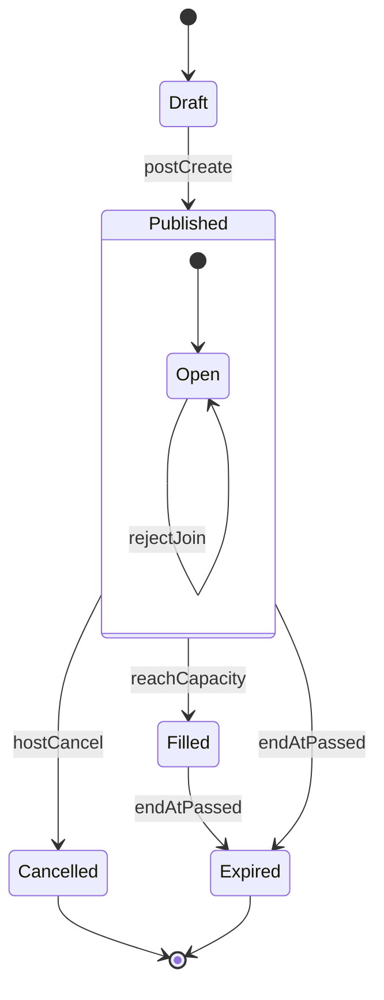
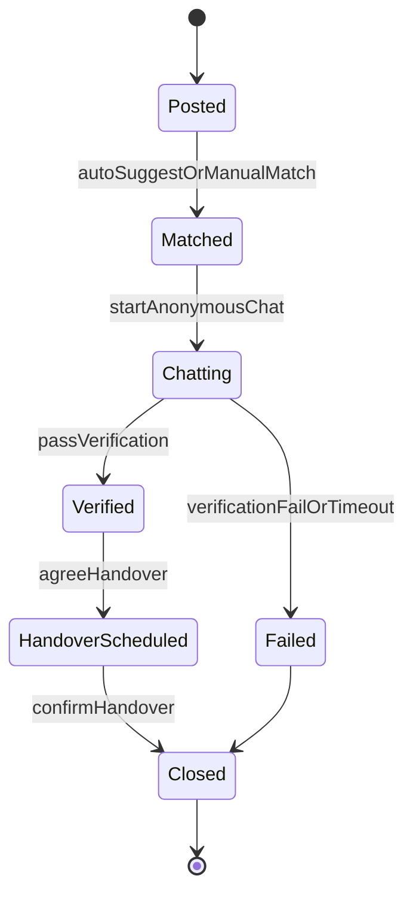
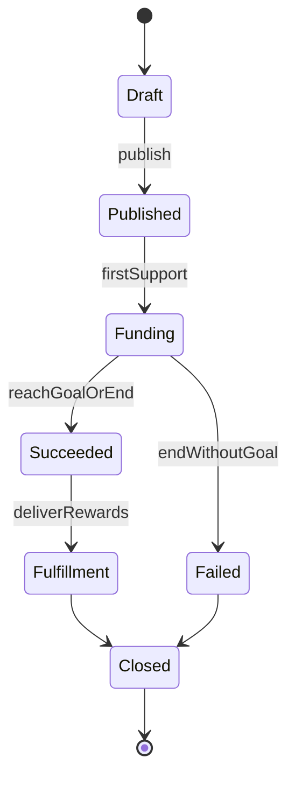
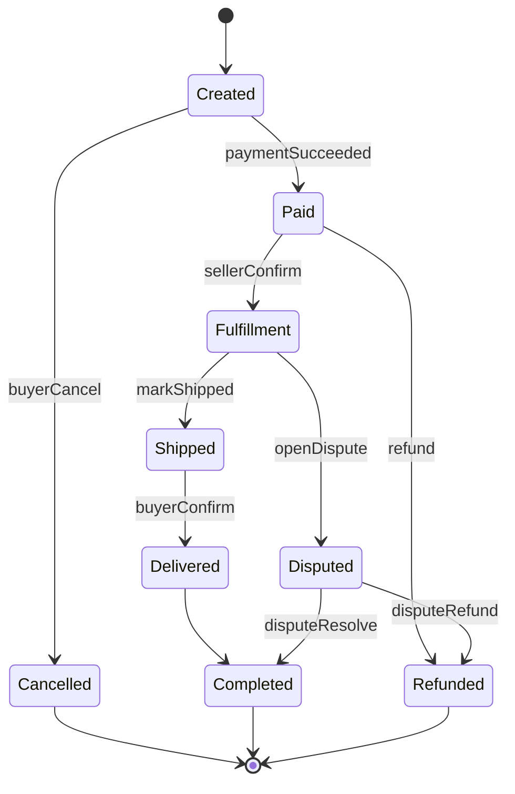

# MVP 范围：页面清单与状态机

本文件把 4 条闭环（邀约/失物/项目支持/作品交易）收敛成“可实现”的页面与状态机，作为后续实现的契约。

## 1) 信息架构（Web/PWA 首版）

- **公共**
  - `/`：首页（场所选择 + 实时大厅入口 + 推荐流）
  - `/auth`：登录/注册（首版可匿名/轻注册）
  - `/messages`：消息（私聊/群聊列表）
  - `/profile`：个人主页（“卡包”：徽章、声誉、历史互动、订单/支持记录）
- **互动（Invite）**
  - `/interact`：场所实时大厅（按 Venue + 时间窗口聚合）
  - `/interact/new`：发布邀约
  - `/interact/:postId`：邀约详情（加入/申请/群聊入口）
- **失物（Lost/Found）**
  - `/lost`：失物/招领大厅（按 Venue + 时间窗口筛选）
  - `/lost/new?type=lost|found`：发布丢失/捡到
  - `/lost/:postId`：详情（匿名对话、验证问题）
- **创作项目支持（ProjectSupport）**
  - `/projects`：项目流（创作项目）
  - `/projects/new`：发布项目
  - `/projects/:projectId`：项目详情（更新、支持、回报）
- **作品交易（Marketplace）**
  - `/market`：市集
  - `/market/new`：上架
  - `/market/:listingId`：商品详情
  - `/orders/:orderId`：订单详情
- **公益（Charity）**
  - `/charity`：公益项目列表（首版可先做“平台自捐公示/合作机构项目”）
  - `/charity/:projectId`：公益项目详情（披露信息、捐赠入口/跳转）

## 2) 统一内容模型：Post（邀约/失物/招领）

首版把“邀约/失物/招领”统一为 `Post`，避免做多套流与审核逻辑。

- `Post.type`: `invite | lost | found`
- `Post.venueId`: 场所ID（只存场所，不做持续定位）
- `Post.timeWindow`: `startAt/endAt`（用于“精准时间地点匹配”）
- `Post.tags`: `["eat","art","help"]`（规则/AI生成）
- `Post.visibility`: `public | venue_only`
- `Post.safetyLevel`: `normal | sensitive`（触发更强提示/限制）

## 3) 状态机

### 3.1 邀约（Invite）状态机

**规则（首版）**
- 加入方式：`open_join`（直接加入）或 `request_to_join`（申请审核）
- 安全降级：夜间/敏感标签 → 强提示 + 限制人数 + 默认群聊优先

### 3.2 失物（Lost/Found）匹配与交接状态机

**验证（首版）**
- 物品特征问答（平台建议 2-3 个“只有失主知道”的点）
- 图片遮罩/局部图（减少冒领）

### 3.3 项目支持（ProjectSupport）状态机

### 3.4 作品交易（MarketplaceOrder）状态机

```mermaid
stateDiagram-v2
  [*] --> Created
  Created --> Paid: paymentSucceeded
  Created --> Cancelled: buyerCancel
  Paid --> Fulfillment: sellerConfirm
  Fulfillment --> Shipped: markShipped
  Shipped --> Delivered: buyerConfirm
  Delivered --> Completed
  Paid --> Refunded: refund
  Fulfillment --> Disputed: openDispute
  Disputed --> Refunded: disputeRefund
  Disputed --> Completed: disputeResolve
  Cancelled --> [*]
  Completed --> [*]
  Refunded --> [*]
```

# MVP 范围：页面清单与状态机

本文件把 4 条闭环（邀约/失物/项目支持/作品交易）收敛成“可实现”的页面与状态机，作为后续实现的契约。

## 1) 信息架构（Web/PWA 首版）

- **公共**
  - `/`：首页（场所选择 + 实时大厅入口 + 推荐流）
  - `/auth`：登录/注册（首版可匿名/轻注册）
  - `/messages`：消息（私聊/群聊列表）
  - `/profile`：个人主页（“卡包”：徽章、声誉、历史互动、订单/支持记录）
- **互动（Invite）**
  - `/interact`：场所实时大厅（按 Venue + 时间窗口聚合）
  - `/interact/new`：发布邀约
  - `/interact/:postId`：邀约详情（加入/申请/群聊入口）
- **失物（Lost/Found）**
  - `/lost`：失物/招领大厅（按 Venue + 时间窗口筛选）
  - `/lost/new?type=lost|found`：发布丢失/捡到
  - `/lost/:postId`：详情（匿名对话、验证问题）
- **创作项目支持（Project）**
  - `/projects`：项目流（创作/公益项目）
  - `/projects/new`：发布项目（首版仅“创作项目支持”，公益募捐单独模块）
  - `/projects/:projectId`：项目详情（更新、支持、回报）
- **市集交易（Listing/Order）**
  - `/market`：市集
  - `/market/new`：上架
  - `/market/:listingId`：商品详情
  - `/orders/:orderId`：订单详情
- **公益（Charity）**
  - `/charity`：公益项目列表（首版可先做“平台自捐公示/合作机构项目”）
  - `/charity/:projectId`：公益项目详情（披露信息、捐赠入口/跳转）

## 2) 统一内容模型：Post

首版把“邀约/失物/招领”统一为 `Post`，避免做多套流与审核逻辑。

- `Post.type`: `invite | lost | found`
- `Post.venueId`: 场所ID（只存场所，不做持续定位）
- `Post.timeWindow`: `startAt/endAt`（用于“精准时间地点匹配”）
- `Post.tags`: `["eat","art","help"]`（AI/规则生成）
- `Post.visibility`: `public | venue_only`
- `Post.safetyLevel`: `normal | sensitive`（触发更强提示/限制）

## 3) 状态机

### 3.1 邀约（Invite）状态机

**规则（首版）**
- 加入方式：`open_join`（直接加入）或 `request_to_join`（申请审核）
- 安全降级：夜间/敏感标签 → 强提示 + 限制人数 + 默认群聊优先

### 3.2 失物（Lost/Found）匹配与交接状态机

**验证（首版）**
- 物品特征问答（平台建议 2-3 个“只有失主知道”的点）
- 图片遮罩/局部图（减少冒领）

### 3.3 项目支持（Project Support）状态机

### 3.4 作品交易（Marketplace Order）状态机

