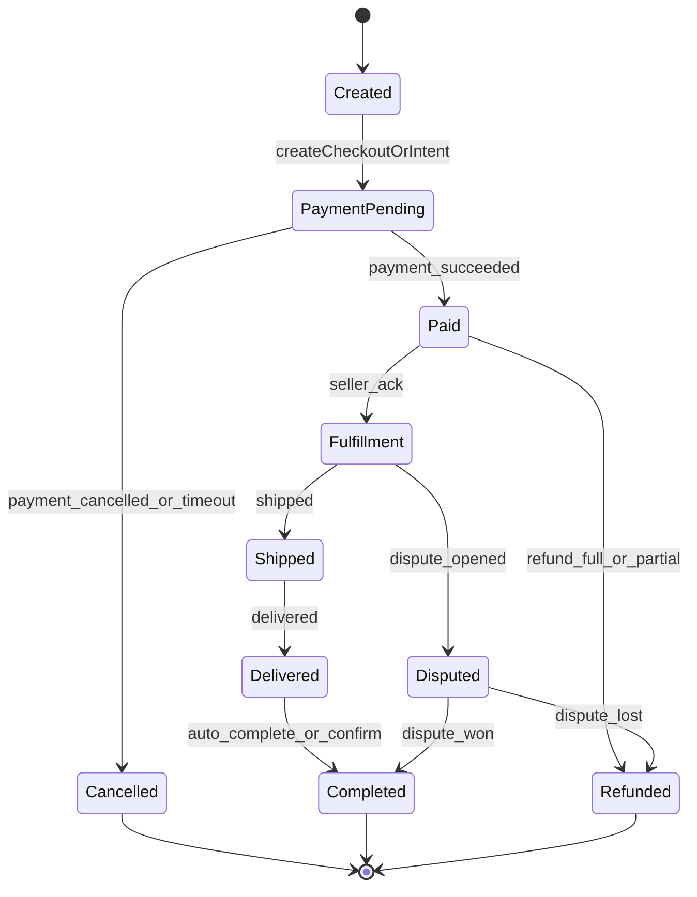
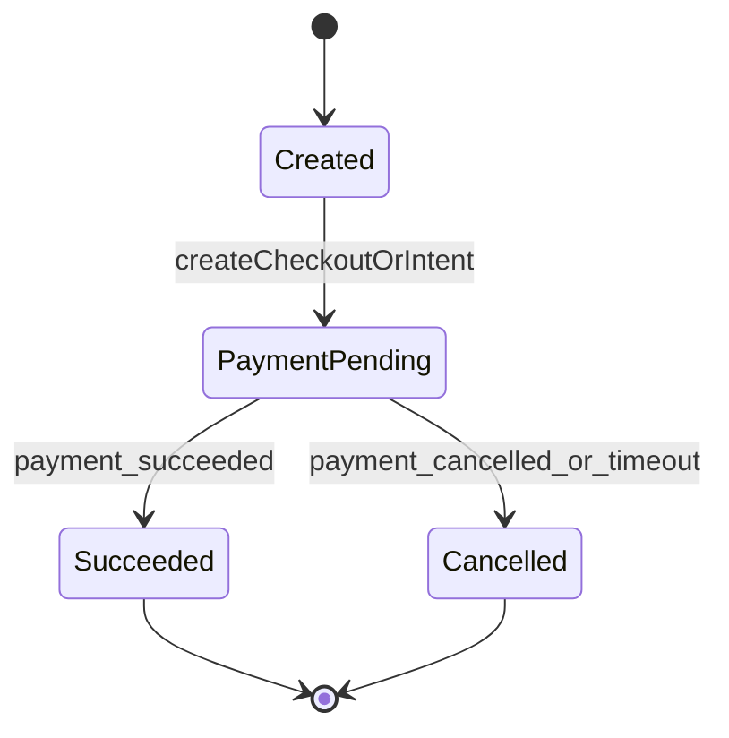

# 支付与抽成（Stripe/Marketplace 设计稿）

目标：平台可对每笔订单抽成，但**不自建收单/清结算**，把卡数据与资金传输风险交给合规支付服务商（Stripe/Connect 或同类平台方案）。

> 本文件先定义状态机与Webhook契约；首版可先“模拟支付”，等你确定合作方后再接真实密钥。

## 1) 角色与模式

- **Platform**：阿邦平台（抽成、风控、对账）
- **Seller/Creator**：卖家/创作者（收款主体）
- **Buyer**：买家/支持者
- **PSP**：支付服务商（Stripe/Airwallex/Adyen 等）

### 1.1 推荐模式
- **Marketplace 分账**：平台创建 PaymentIntent/Checkout，指定 `application_fee_amount`（抽成）+ `transfer_data[destination]`（卖家），由 PSP 分账与结算。
- **Creator 支持/打赏**：可复用同一套分账模式，或先做“平台收款后再结算”（更重合规，不建议首版）。

## 2) 状态机

### 2.1 Order（交易订单）

### 2.2 Support（项目支持/打赏）

## 3) Stripe Webhook（建议接收并落库的事件）

- `checkout.session.completed`
- `payment_intent.succeeded`
- `payment_intent.payment_failed`
- `charge.refunded`
- `charge.dispute.created`
- `charge.dispute.closed`

## 4) 抽成与费用展示（降低合规/争议风险）

- 订单页**显著披露**：平台服务费/抽成比例、支付处理费、退款规则。
- 对公益模块：若涉及捐赠入口，必须单独披露“是否收取平台费用/技术服务费/支付手续费”，且按地区合规要求调整。

## 5) 多币种与“统一HKD记账”

- **展示币种**可根据用户地区切换；\n- **内部账本**可统一用 HKD 记账（按 PSP 返回的 FX rate 做折算），用于统计与财务报表；\n- 真实结算币种以 PSP/卖家账户币种为准。

## 6) 加密货币

- 中国大陆：平台内禁止任何加密货币支付/引导/撮合（风控与审核需强拦截）。\n- 港/美：如未来要支持，也建议通过合规合作方完成，平台不托管私钥、不做兑换、不做转账。

